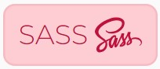
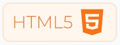

<!--
**thureindev/thureindev** is a ✨ _special_ ✨ repository because its `README.md` (this file) appears on your GitHub profile.

Here are some ideas to get you started:

- 🔭 I’m currently working on ...
- 🌱 I’m currently learning ...
- 👯 I’m looking to collaborate on ...
- 🤔 I’m looking for help with ...
- 💬 Ask me about ...
- 📫 How to reach me: ...
- 😄 Pronouns: ...
- ⚡ Fun fact: ...
-->

# Hi there 👋, I'm ThuRein!

I'm a Web Developer specializing in MERN stack, with a knack for Python and PHP. Passionate about learning and exploring new technologies, I love turning ideas into reality and contributing to open source.

- 🔭 I’m currently working on some cool freelance projects.
- 🌱 I’m always learning and challenging myself with new skills.
- 💬 Ask me about Web Development, Python, Automation, or anything tech-related!
- 📫 How to reach me: [thureindev@outlook.com](mailto:thureindev@outlook.com)

## Connect with me
- LinkedIn: 
- Twitter: 
- Instagram: 
- Portfolio: [https://thureindev.github.io](https://thureindev.github.io/)

## My Skills
- **Languages**: 
   
   
   
  
- **Web Development**: 
   
   
   
   
   
   
- **Frontend**:
   
   
   
  
   
  
- **Databases**: 
   
   
  
- **Tools**: 
   
   
  
  

## Recent Projects
- **Tipsy Tavern**: Open your fridge and make a cocktail [https://thureindev.github.io/tipsy-tavern](#)
- **Artist portfolio**: Portfolio site for my Artist Client [https://www.nandarblender.com](#)

## Get in Touch
Feel free to contact me for web projects, collaborations, or just for a chat. Also, I’m actively looking for a juicy full-time job, so if you have something exciting, let’s talk!
- 📧 Email: [thureindev@outlook.com](mailto:thureindev@outlook.com)
- 🌐 Portfolio: 

